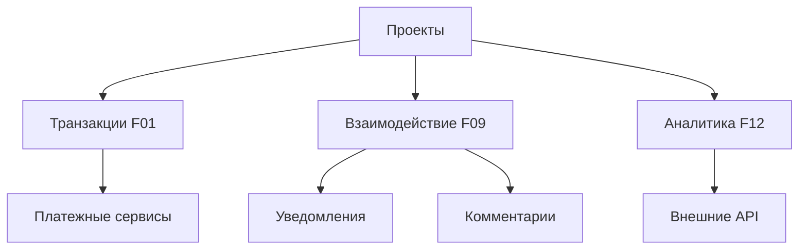
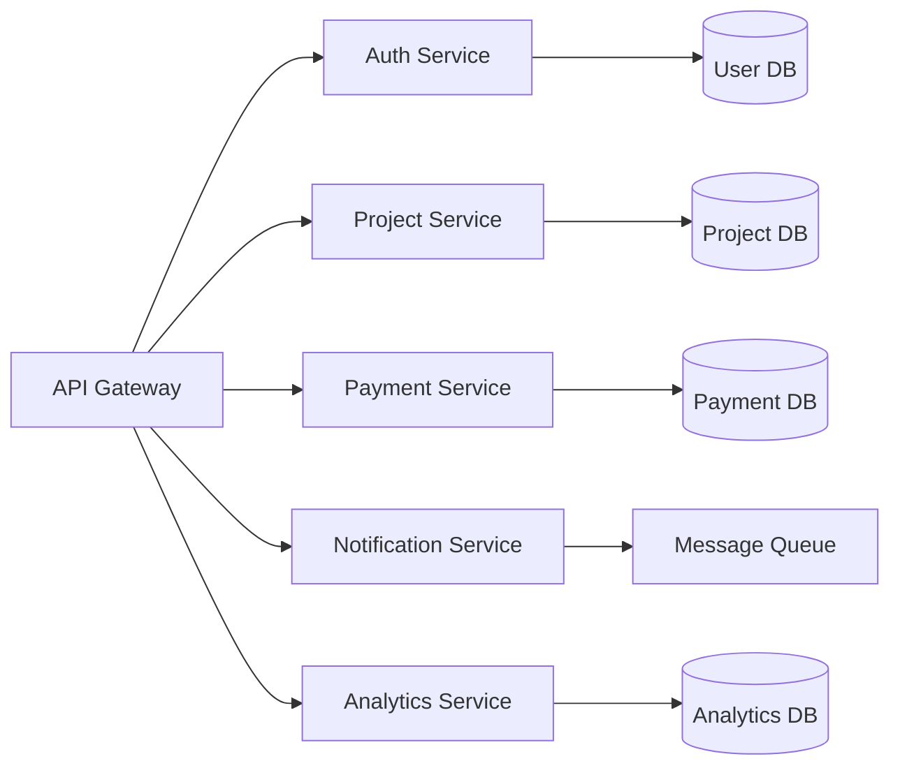

# Выбор архитектурной формы системы

## Метаданные

| Атрибут | Значение |
|---------|----------|
| Статус | ✅ Принято |
| Дата | 2023-09-01 |
| Автор | Команда разработки |
| Последнее обновление | 2024-01-05 |

## Контекст

При разработке платформы для краудфандинга необходимо выбрать архитектурную форму системы, удовлетворяющую следующим требованиям:

### Ключевые метрики

| Категория | Код | Требование | Целевое значение |
|-----------|-----|------------|------------------|
| Масштабируемость | SCA02 | Рост пользовательской базы | 1 000 000 через 5 лет |
| Масштабируемость | SCA03 | Пиковая нагрузка транзакций | 10 000 / час |
| Доступность | AVA01 | Время работы системы | 99.9% |
| Надежность | DUR02 | Восстановление после сбоев | < 1 час |
| Производительность | PER01 | Время отклика | ≤ 2 секунд |
| Гибкость | PRN04 | Внедрение новых функций | < 2 недели |

### Ключевые бизнес-процессы

## Рассмотренные варианты

### 1. Модульный монолит

#### Преимущества
- 👍 Простота разработки и развертывания
- 👍 Единая кодовая база
- 👍 Низкая начальная сложность

#### Недостатки
- 👎 Сложности с масштабированием
- 👎 Риск каскадных сбоев
- 👎 Медленный релизный цикл

### 2. Микросервисы

#### Преимущества
- 👍 Независимое масштабирование
- 👍 Изоляция сбоев
- 👍 Гибкость в выборе технологий
- 👍 Быстрые релизы

#### Недостатки
- 👎 Сложность разработки и поддержки
- 👎 Распределенные транзакции
- 👎 Повышенные требования к инфраструктуре

### 3. Серверлесс

#### Преимущества
- 👍 Автоматическое масштабирование
- 👍 Оплата за использование
- 👍 Минимальное управление инфраструктурой

#### Недостатки
- 👎 Холодный старт
- 👎 Привязка к провайдеру
- 👎 Ограничения по времени выполнения

## Решение

> Выбрана архитектура микросервисов

### Ключевые микросервисы

### Обоснование

#### Соответствие требованиям
| Требование | Реализация |
|------------|------------|
| SCA02 | Независимое масштабирование сервисов |
| SCA03 | Горизонтальное масштабирование платежного сервиса |
| AVA01 | Изоляция сбоев между сервисами |
| DUR02 | Быстрое восстановление отдельных сервисов |
| PER01 | Оптимизация каждого сервиса под конкретные задачи |
| PRN04 | Независимая разработка и деплой сервисов |

#### Технические преимущества
1. 🔄 Независимое масштабирование сервисов
2. 🛡️ Изоляция сбоев
3. 🚀 Гибкость в выборе технологий
4. 📦 Быстрый цикл разработки

#### Организационные преимущества
1. 👥 Автономные команды разработки
2. 🎯 Четкие границы ответственности
3. 📈 Параллельная разработка
4. 🔍 Упрощенное тестирование

## Последствия

### Положительные
- ✅ Высокая масштабируемость системы
- ✅ Улучшенная отказоустойчивость
- ✅ Гибкость в выборе технологий
- ✅ Ускорение разработки новых функций

### Отрицательные
- ❌ Повышенная сложность разработки
- ❌ Сложность отладки распределенных проблем
- ❌ Необходимость в сильной DevOps экспертизе
- ❌ Повышенные затраты на инфраструктуру

## Связанные ADR
- [2023-09.2 - Выбор технологии программирования серверной части](./2023-09.2%20-%20Выбор%20технологии%20программирования%20серверной%20части.md)
- [2023-09.4 - Выбор системы хранения данных](./2023-09.4%20-%20Выбор%20системы%20хранения%20данных.md)
- [2024-01.3 - Выбор событийно-ориентированной архитектуры](./2024-01.3%20-%20Выбор%20событийно-ориентированной%20архитектуры.md)