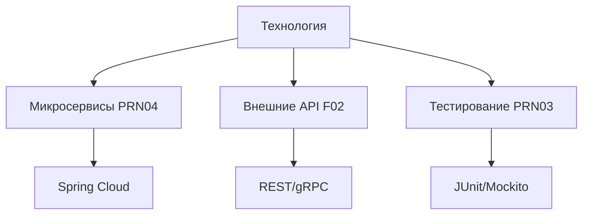
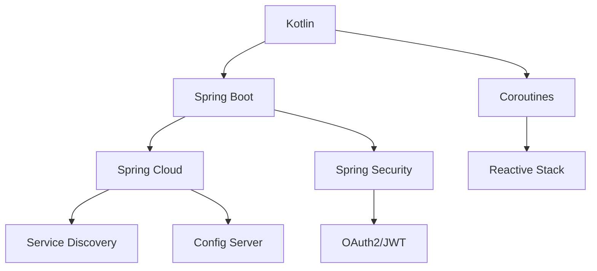

# Выбор технологии программирования серверной части

## Метаданные

| Атрибут | Значение |
|---------|----------|
| Статус | ✅ Принято |
| Дата | 2023-09-02 |
| Автор | Команда разработки |
| Последнее обновление | 2024-01-05 |

## Контекст

Для реализации серверной части краудфандинговой платформы необходимо выбрать технологию программирования, которая обеспечит выполнение следующих требований:

### Ключевые метрики

| Категория | Код | Требование | Целевое значение |
|-----------|-----|------------|------------------|
| Производительность | PER01 | Время отклика | ≤ 2 секунд |
| Производительность | PER02 | Обработка платежей | ≤ 5 секунд |
| Масштабируемость | SCA01 | Начальная нагрузка | 50 000 пользователей |
| Масштабируемость | SCA02 | Целевая нагрузка | 1 000 000 через 5 лет |
| Доступность | AVA01 | Время работы | 99.9% |
| Процессы | PRN03 | Автоматизация | CI/CD pipeline |
| Процессы | PRN07 | Частота релизов | Еженедельно |

### Технические требования

## Рассмотренные варианты

### 1. Kotlin

#### Преимущества
- 👍 Современный язык на JVM
- 👍 Корутины для асинхронного программирования
- 👍 Безопасность типов
- 👍 Совместимость с Java-экосистемой
- 👍 Отличная поддержка Spring Framework

#### Недостатки
- 👎 Требует больше ресурсов чем Go
- 👎 Медленный холодный старт JVM
- 👎 Сложность в освоении корутин

### 2. Python

#### Преимущества
- 👍 Быстрая разработка
- 👍 Большая экосистема библиотек
- 👍 Простота освоения
- 👍 Отличная поддержка ML/AI

#### Недостатки
- 👎 Низкая производительность
- 👎 GIL ограничивает многопоточность
- 👎 Проблемы с типизацией

### 3. Go

#### Преимущества
- 👍 Высокая производительность
- 👍 Встроенная поддержка конкурентности
- 👍 Низкое потребление ресурсов
- 👍 Простота развертывания

#### Недостатки
- 👎 Ограниченная экосистема
- 👎 Отсутствие дженериков
- 👎 Меньше специалистов на рынке

### 4. Node.js

#### Преимущества
- 👍 Единый язык frontend/backend
- 👍 Большая экосистема npm
- 👍 Отличная производительность I/O
- 👍 Легкость масштабирования

#### Недостатки
- 👎 Callback hell
- 👎 Слабая типизация
- 👎 Сложность поддержки больших проектов

## Решение

> Выбран Kotlin как основной язык разработки серверной части

### Обоснование по требованиям

| Требование | Реализация в Kotlin |
|------------|---------------------|
| PER01 | JVM оптимизации + корутины |
| PER02 | Асинхронная обработка платежей |
| SCA01 | Spring Cloud для микросервисов |
| SCA02 | Горизонтальное масштабирование |
| AVA01 | Надежность JVM + мониторинг |
| PRN03 | Интеграция с Jenkins/TeamCity |
| PRN07 | Spring Boot автоконфигурация |

### Технический стек

## Последствия

### Положительные
- ✅ Высокая производительность и масштабируемость
- ✅ Безопасность типов на этапе компиляции
- ✅ Богатая экосистема Spring
- ✅ Современные паттерны асинхронного программирования

### Отрицательные
- ❌ Повышенные требования к инфраструктуре
- ❌ Необходимость обучения команды
- ❌ Более длительный процесс сборки
- ❌ Сложность отладки корутин

## План внедрения

1. 📚 Обучение команды (1 месяц)
2. 🛠️ Настройка инфраструктуры CI/CD (2 недели)
3. 🔨 Разработка прототипа (1 месяц)
4. 🧪 Нагрузочное тестирование (2 недели)
5. 🚀 Запуск первого микросервиса (1 месяц)

## Связанные ADR
- [2023-09.1 - Выбор архитектурной формы системы](./2023-09.1%20-%20Выбор%20архитектурной%20формы%20системы.md)
- [2023-09.4 - Выбор системы хранения данных](./2023-09.4%20-%20Выбор%20системы%20хранения%20данных.md)
- [2024-01.3 - Выбор событийно-ориентированной архитектуры](./2024-01.3%20-%20Выбор%20событийно-ориентированной%20архитектуры.md)