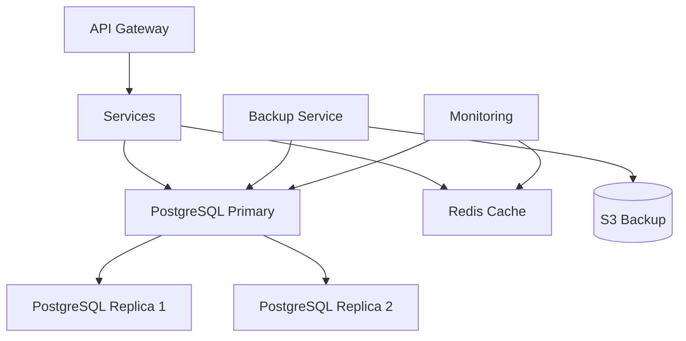
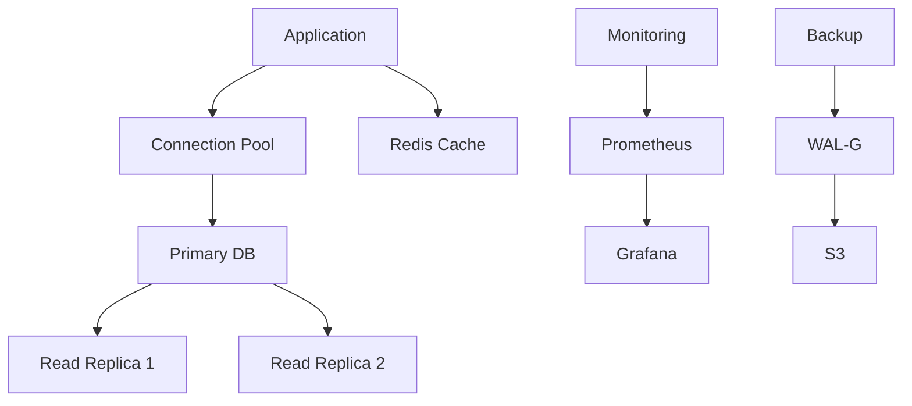

# Выбор системы хранения данных

## Метаданные

| Атрибут | Значение |
|---------|----------|
| Статус | ✅ Принято |
| Дата | 2023-09-04 |
| Автор | Команда разработки |
| Последнее обновление | 2024-01-05 |

## Контекст

Для обеспечения надежного хранения и обработки данных краудфандинговой платформы необходимо выбрать оптимальную систему хранения данных.

### Ключевые требования

| Категория | Код | Требование | Целевое значение |
|-----------|-----|------------|------------------|
| Масштабируемость | SCA01 | Рост данных | 1 000 000 пользователей |
| Масштабируемость | SCA03 | Пиковая нагрузка | 10 000 тр./час |
| Доступность | AVA01 | Время работы | 99.9% |
| Надежность | DUR02 | Восстановление | < 1 час |
| Производительность | PER01 | Время отклика | ≤ 2 секунд |
| Безопасность | SEC01 | Шифрование | AES-256 |
| Безопасность | SEC02 | Защита данных | GDPR, LGPD |
| Распределение | DUR03 | Гео-репликация | Multi-region |

### Архитектура данных

## Рассмотренные варианты

### 1. PostgreSQL 🎯

#### Преимущества
- 👍 Надежность и стабильность
- 👍 ACID транзакции
- 👍 JSON поддержка
- 👍 Расширяемость
- 👍 Репликация из коробки

#### Недостатки
- 👎 Вертикальное масштабирование
- 👎 Сложность шардинга
- 👎 Требования к ресурсам

### 2. MongoDB 📄

#### Преимущества
- 👍 Гибкая схема данных
- 👍 Горизонтальное масштабирование
- 👍 Высокая производительность
- 👍 Простота использования

#### Недостатки
- 👎 Отсутствие ACID
- 👎 Сложность транзакций
- 👎 Больше места для хранения
- 👎 Риск потери данных

### 3. Cassandra ⚡

#### Преимущества
- 👍 Линейная масштабируемость
- 👍 Multi-DC репликация
- 👍 Высокая доступность
- 👍 Отличная производительность

#### Недостатки
- 👎 Eventual consistency
- 👎 Сложность запросов
- 👎 Ограниченные транзакции
- 👎 Сложность поддержки

## Решение

> Выбран PostgreSQL в комбинации с Redis для кэширования

### Архитектура решения

### Реализация

1. 💾 Основное хранение
   - PostgreSQL 15+
   - Синхронная репликация
   - Point-in-time recovery

2. 🚀 Оптимизация
   - Connection pooling
   - Query optimization
   - Партиционирование

3. 🔄 Кэширование
   - Redis cluster
   - Cache invalidation
   - Session storage

4. 📊 Мониторинг
   - DB metrics
   - Query performance
   - Cache hit ratio

### Технические детали

1. 🛠️ Компоненты
   - PostgreSQL 15
   - Redis 7
   - PgBouncer
   - WAL-G

2. ⚙️ Конфигурация
   - Max connections: 1000
   - Shared buffers: 25% RAM
   - WAL level: logical
   - Archive mode: on

## Последствия

### Положительные 👍
- Надежное хранение данных
- ACID гарантии
- Простота бэкапов
- JSON поддержка
- Богатая экосистема

### Отрицательные 👎
- Вертикальное масштабирование
- Сложность шардинга
- Требования к ресурсам
- Стоимость лицензий

## План внедрения

### Фаза 1: Базовая настройка (1 месяц)
1. 🎯 Primary DB
   - Установка PostgreSQL
   - Базовая оптимизация
   - Мониторинг

2. 🔄 Репликация
   - Настройка реплик
   - Failover тесты
   - Балансировка нагрузки

### Фаза 2: Оптимизация (2 месяца)
1. 🚀 Производительность
   - Query optimization
   - Индексы
   - Партиционирование

2. 🛡️ Безопасность
   - Шифрование
   - Аудит
   - Бэкапы

## Связанные ADR
- [2023-09.1 - Выбор архитектурной формы системы](./2023-09.1%20-%20Выбор%20архитектурной%20формы%20системы.md)
- [2024-01.3 - Выбор событийно-ориентированной архитектуры](./2024-01.3%20-%20Выбор%20событийно-ориентированной%20архитектуры.md)
- [2024-01.4 - Архитектура поиска и рекомендаций](./2024-01.4%20-%20Архитектура%20поиска%20и%20рекомендаций.md)
