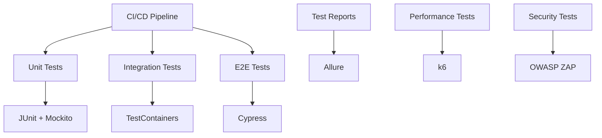
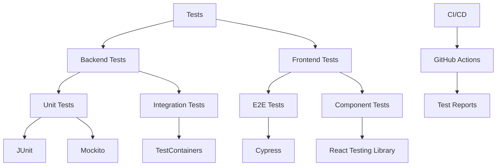

# Выбор инструментов автоматического тестирования

## Метаданные

| Атрибут | Значение |
|---------|----------|
| Статус | ✅ Принято |
| Дата | 2023-09-06 |
| Автор | Команда разработки |
| Последнее обновление | 2024-01-05 |

## Контекст

Для обеспечения качества разработки краудфандинговой платформы необходимо выбрать комплексный набор инструментов автоматического тестирования.

### Ключевые требования

| Категория | Код | Требование | Целевое значение |
|-----------|-----|------------|------------------|
| CI/CD | PRN07 | Интеграция с пайплайнами | Автоматизация |
| Производительность | PER01 | Время отклика | ≤ 2 секунд |
| Безопасность | SEC01 | Тесты безопасности | OWASP Top 10 |
| Платформы | PLT02 | iOS/Android тесты | Кросс-платформа |
| Платформы | PLT03 | Веб-тесты | Все браузеры |
| Мониторинг | MON01 | Отчетность | Real-time |
| Покрытие | COV01 | Unit tests | > 80% |
| Покрытие | COV02 | Integration tests | > 70% |
| Покрытие | COV03 | E2E tests | > 50% |

### Архитектура тестирования

## Рассмотренные варианты

### 1. JUnit + Mockito 🧪

#### Преимущества
- 👍 Интеграция с Kotlin
- 👍 Мощный мокинг
- 👍 Большое сообщество
- 👍 Богатая экосистема

#### Недостатки
- 👎 Только для JVM
- 👎 Сложность мок-объектов
- 👎 Медленные тесты

### 2. Cypress 🌲

#### Преимущества
- 👍 Современный E2E фреймворк
- 👍 Встроенный UI
- 👍 Простота отладки
- 👍 Real-time перезапуск

#### Недостатки
- 👎 Только веб-тестирование
- 👎 Ограничения cross-origin
- 👎 Нет multi-tab поддержки

### 3. Selenium 🤖

#### Преимущества
- 👍 Кросс-браузерность
- 👍 Многоязычность
- 👍 Гибкость
- 👍 Зрелость

#### Недостатки
- 👎 Сложность настройки
- 👎 Медленные тесты
- 👎 Хрупкие тесты
- 👎 Высокая сложность

## Решение

> Выбрана комбинация JUnit + Mockito для бэкенда и Cypress для фронтенда

### Архитектура решения

### Реализация

1. 🧪 Модульное тестирование
   - JUnit 5
   - Mockito
   - Kotlin test

2. 🔄 Интеграционное тестирование
   - TestContainers
   - REST Assured
   - Spring Test

3. 🌲 E2E тестирование
   - Cypress
   - React Testing Library
   - Jest

4. 📊 Отчетность
   - Allure Reports
   - Test coverage
   - Performance metrics

### Технические детали

1. 🛠️ Компоненты
   - JUnit 5.9+
   - Mockito 5.0+
   - Cypress 12+
   - TestContainers

2. ⚙️ Конфигурация
   - Parallel execution
   - Test retries
   - Screenshot on failure
   - Video recording

## Последствия

### Положительные 👍
- Комплексное тестирование
- Быстрая обратная связь
- Автоматизация CI/CD
- Высокое качество кода
- Снижение рисков

### Отрицательные 👎
- Сложность поддержки
- Время на написание тестов
- Ложные срабатывания
- Обучение команды

## План внедрения

### Фаза 1: Базовая настройка (1 месяц)
1. 🎯 Backend testing
   - JUnit setup
   - Mockito integration
   - Basic test suite

2. 🔄 Frontend testing
   - Cypress installation
   - Component tests
   - E2E scenarios

### Фаза 2: Расширение (2 месяца)
1. 🚀 Расширенное тестирование
   - Performance tests
   - Security tests
   - API tests

2. 📊 Мониторинг
   - Test metrics
   - Coverage reports
   - Performance tracking

## Связанные ADR
- [2023-09.1 - Выбор архитектурной формы системы](./2023-09.1%20-%20Выбор%20архитектурной%20формы%20системы.md)
- [2023-09.7 - Выбор технологического процесса разработки](./2023-09.7%20-%20Выбор%20технологического%20процесса%20разработки.md)
- [2023-10.20 - Выбор технологии программирования клиентского приложения](./2023-10.20%20-%20Выбор%20технологии%20программирования%20клиентского%20приложения.md)