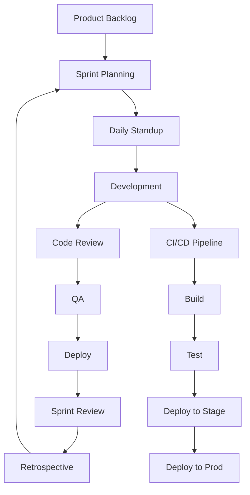
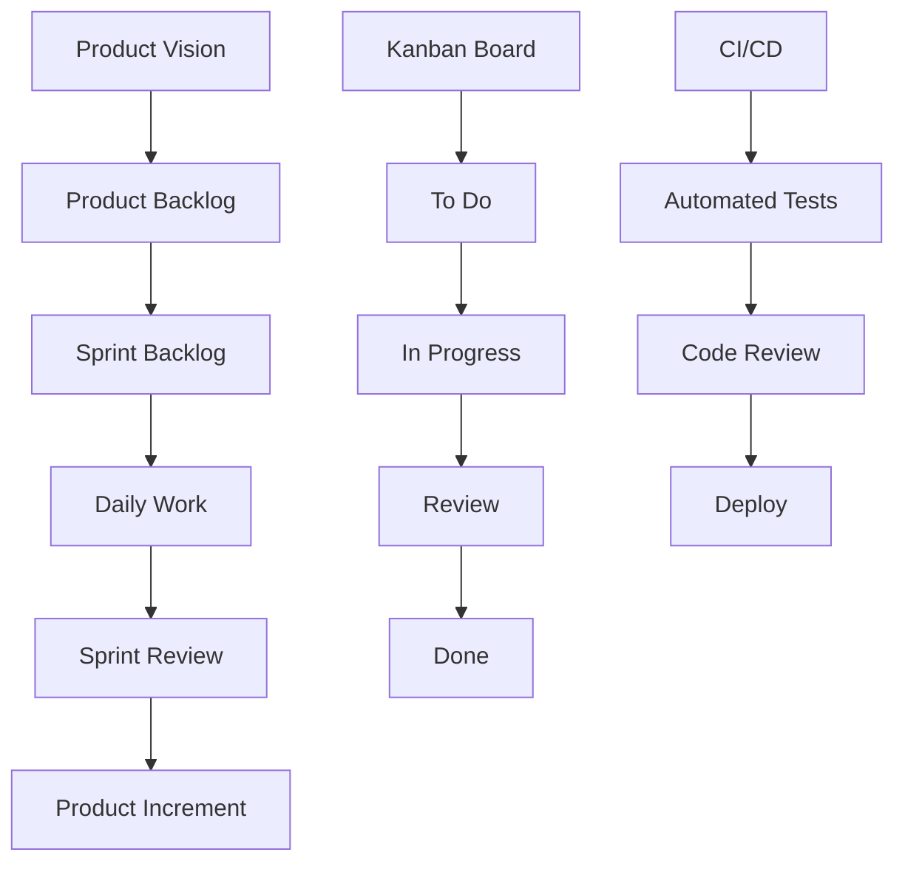

# Выбор технологического процесса разработки

## Метаданные

| Атрибут | Значение |
|---------|----------|
| Статус | ✅ Принято |
| Дата | 2023-09-07 |
| Автор | Команда разработки |
| Последнее обновление | 2024-01-05 |

## Контекст

Для эффективной разработки краудфандинговой платформы необходимо выбрать оптимальный технологический процесс, обеспечивающий качество, скорость и предсказуемость разработки.

### Ключевые требования

| Категория | Код | Требование | Целевое значение |
|-----------|-----|------------|------------------|
| Качество | QUA01 | Code review | 100% кода |
| CI/CD | PRN07 | Автоматизация | Полная |
| Время | TIM01 | Time-to-market | < 3 месяца |
| Гибкость | FLX01 | Изменения | < 24 часа |
| Масштаб | SCA01 | Команда | До 20 человек |
| Документация | DOC01 | Покрытие | > 80% |
| Тестирование | TST01 | Покрытие | > 80% |
| Релизы | REL01 | Частота | Bi-weekly |

### Процесс разработки

## Рассмотренные варианты

### 1. Scrum 🔄

#### Преимущества
- 👍 Гибкость
- 👍 Прозрачность
- 👍 Предсказуемость
- 👍 Быстрая обратная связь

#### Недостатки
- 👎 Overhead на церемонии
- 👎 Зависимость от команды
- 👎 Сложность оценки

### 2. Kanban 📋

#### Преимущества
- 👍 Непрерывный поток
- 👍 Минимум церемоний
- 👍 Фокус на эффективность
- 👍 Гибкие приоритеты

#### Недостатки
- 👎 Нет временных рамок
- 👎 Сложность планирования
- 👎 Риск застоя задач

### 3. Waterfall 📝

#### Преимущества
- 👍 Четкое планирование
- 👍 Понятные этапы
- 👍 Полная документация
- 👍 Предсказуемость

#### Недостатки
- 👎 Низкая гибкость
- 👎 Долгий цикл
- 👎 Поздняя обратная связь
- 👎 Высокие риски

## Решение

> Выбран Scrum с элементами Kanban для оптимизации потока задач

### Архитектура процесса

### Реализация

1. 📅 Спринты
   - 2 недели
   - Фиксированная команда
   - Ежедневные встречи
   - Sprint Review

2. 🎯 Планирование
   - Grooming
   - Planning Poker
   - Velocity tracking
   - Burndown charts

3. 🔄 Разработка
   - Feature branches
   - Pull requests
   - Code review
   - Pair programming

4. 📊 Метрики
   - Velocity
   - Burndown
   - Lead time
   - Cycle time

### Технические практики

1. 🛠️ Инструменты
   - Jira
   - GitHub
   - Jenkins
   - Confluence

2. ⚙️ Процессы
   - Git Flow
   - Code Review
   - CI/CD
   - Documentation

## Последствия

### Положительные 👍
- Быстрая обратная связь
- Гибкость процесса
- Прозрачность работы
- Качество продукта
- Командная работа

### Отрицательные 👎
- Overhead на встречи
- Сложность оценки
- Зависимость от команды
- Обучение процессу

## План внедрения

### Фаза 1: Подготовка (2 недели)
1. 🎯 Обучение
   - Scrum тренинг
   - Инструменты
   - Процессы
   - Метрики

2. 🔄 Настройка
   - Jira проект
   - GitHub flow
   - CI/CD pipeline
   - Документация

### Фаза 2: Запуск (1 месяц)
1. 🚀 Первые спринты
   - Пилотный спринт
   - Ретроспектива
   - Корректировки
   - Масштабирование

2. 📊 Мониторинг
   - Метрики команды
   - Качество кода
   - Скорость релизов
   - Удовлетворенность

## Связанные ADR
- [2023-09.1 - Выбор архитектурной формы системы](./2023-09.1%20-%20Выбор%20архитектурной%20формы%20системы.md)
- [2023-09.6 - Выбор инструментов автоматического тестирования](./2023-09.6%20-%20Выбор%20инструментов%20автоматического%20тестирования.md)
- [2024-01.3 - Выбор событийно-ориентированной архитектуры](./2024-01.3%20-%20Выбор%20событийно-ориентированной%20архитектуры.md)