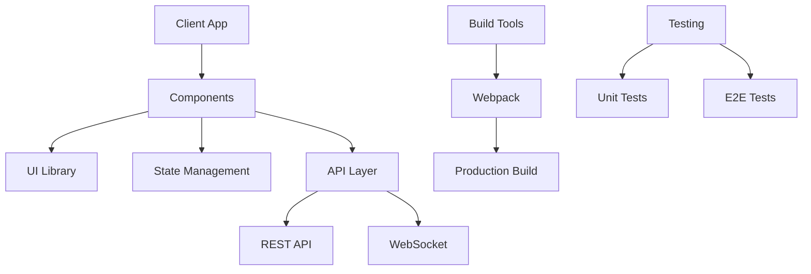
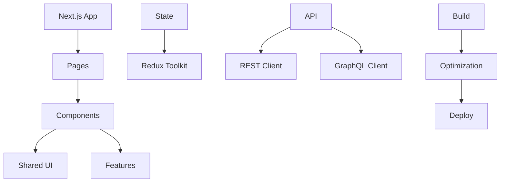

# Выбор технологии программирования клиентского приложения

## Метаданные

| Атрибут | Значение |
|---------|----------|
| Статус | ✅ Принято |
| Дата | 2023-10-20 |
| Автор | Команда разработки |
| Последнее обновление | 2024-01-05 |

## Контекст

Для создания современного, масштабируемого и удобного пользовательского интерфейса краудфандинговой платформы необходимо выбрать оптимальную технологию разработки клиентского приложения.

### Ключевые требования

| Категория | Код | Требование | Целевое значение |
|-----------|-----|------------|------------------|
| Производительность | PER01 | Время загрузки | < 3 секунды |
| UX | UX01 | Отзывчивость UI | < 100ms |
| Масштабируемость | SCA01 | Компоненты | Переиспользуемые |
| SEO | SEO01 | Оптимизация | Server-side |
| Безопасность | SEC01 | XSS защита | Встроенная |
| Поддержка | SUP01 | Браузеры | > 95% |
| Мобильность | MOB01 | Адаптивность | Полная |
| Доступность | ACC01 | WCAG | Level AA |

### Архитектура клиента

## Рассмотренные варианты

### 1. React ⚛️

#### Преимущества
- 👍 Virtual DOM
- 👍 Большая экосистема
- 👍 Компонентный подход
- 👍 Активное сообщество

#### Недостатки
- 👎 SEO сложности
- 👎 Размер бандла
- 👎 Steep learning curve
- 👎 Версионность

### 2. Vue.js 🖖

#### Преимущества
- 👍 Простота изучения
- 👍 Гибкость
- 👍 Производительность
- 👍 Документация

#### Недостатки
- 👎 Меньше экосистема
- 👎 Фрагментация плагинов
- 👎 Меньше специалистов
- 👎 Enterprise поддержка

### 3. Angular 🅰️

#### Преимущества
- 👍 Полный фреймворк
- 👍 TypeScript
- 👍 CLI инструменты
- 👍 Enterprise ready

#### Недостатки
- 👎 Сложность
- 👎 Размер
- 👎 Производительность
- 👎 Порог входа

## Решение

> Выбран React с Next.js для оптимальной производительности и SEO

### Архитектура решения

### Реализация

1. 🎨 UI Framework
   - Material UI
   - Styled Components
   - Responsive Grid
   - Theme System

2. 🔄 State Management
   - Redux Toolkit
   - React Query
   - Local Storage
   - Context API

3. 🚀 Performance
   - Code Splitting
   - Lazy Loading
   - Image Optimization
   - Cache Strategy

4. 📱 Mobile First
   - Responsive Design
   - Touch Events
   - PWA Support
   - Offline Mode

### Технические детали

1. 🛠️ Компоненты
   - React 18+
   - Next.js 13+
   - TypeScript 4.9+
   - Material UI 5+

2. ⚙️ Конфигурация
   - ESLint
   - Prettier
   - Husky
   - Jest

## Последствия

### Положительные 👍
- Быстрая разработка
- SEO оптимизация
- Переиспользуемость
- Масштабируемость
- Экосистема

### Отрицательные 👎
- Сложность настройки
- Размер приложения
- Версионность
- Обучение команды

## План внедрения

### Фаза 1: Базовая настройка (2 недели)
1. 🎯 Инфраструктура
   - Next.js setup
   - TypeScript
   - ESLint/Prettier
   - CI/CD

2. 🔄 Базовые компоненты
   - UI система
   - Роутинг
   - API клиент
   - Авторизация

### Фаза 2: Развитие (1 месяц)
1. 🚀 Функционал
   - Страницы
   - Формы
   - Интеграции
   - Оптимизация

2. 📊 Мониторинг
   - Analytics
   - Error tracking
   - Performance
   - User feedback

## Связанные ADR
- [2023-09.1 - Выбор архитектурной формы системы](./2023-09.1%20-%20Выбор%20архитектурной%20формы%20системы.md)
- [2024-01.1 - Выбор стратегии аутентификации и авторизации](./2024-01.1%20-%20Выбор%20стратегии%20аутентификации%20и%20авторизации.md)
- [2024-01.5 - Архитектура доставки контента](./2024-01.5%20-%20Архитектура%20доставки%20контента.md)
