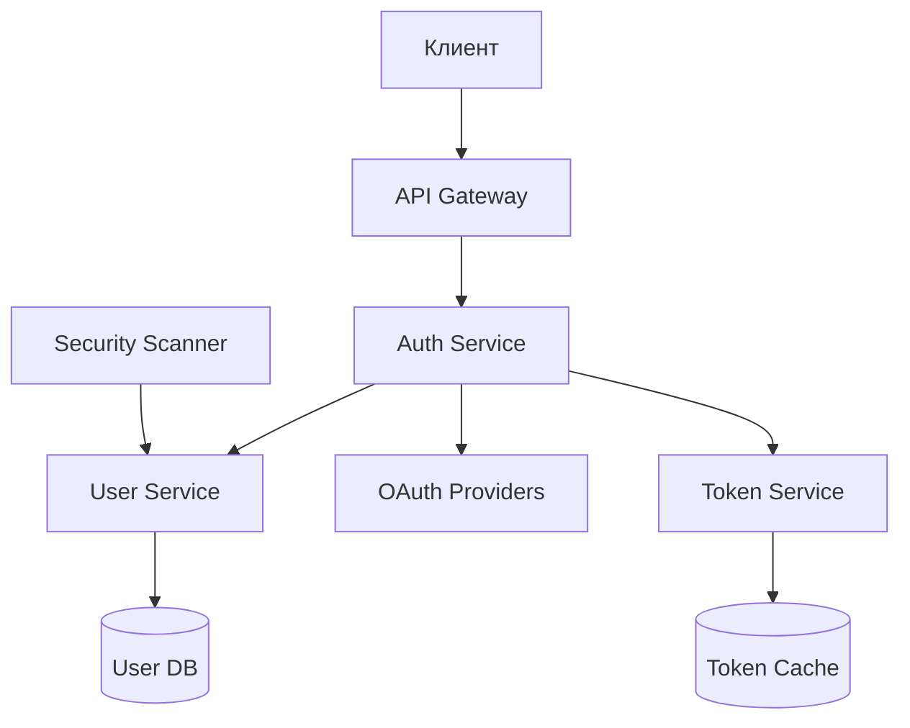
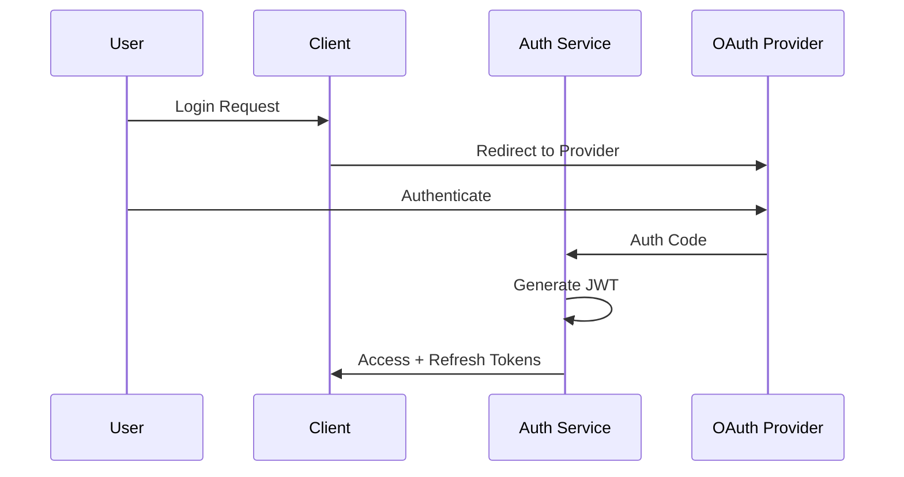

# Выбор стратегии аутентификации и авторизации

## Метаданные

| Атрибут | Значение |
|---------|----------|
| Статус | ✅ Принято |
| Дата | 2024-01-01 |
| Автор | Команда разработки |
| Последнее обновление | 2024-01-05 |

## Контекст

Для обеспечения безопасного доступа к платформе краудфандинга необходимо реализовать надежную систему аутентификации и авторизации.

### Ключевые требования

| Категория | Код | Требование | Целевое значение |
|-----------|-----|------------|------------------|
| Безопасность | SEC01 | Защита данных | Шифрование AES-256 |
| Безопасность | SEC02 | Контроль доступа | RBAC + ABAC |
| Безопасность | SEC03 | Финансовая безопасность | PCI DSS Level 1 |
| UX | UX01 | Время регистрации | < 2 минут |
| UX | UX02 | Соц. сети | ≥ 3 платформы |
| UX | UX03 | Восстановление доступа | < 5 минут |
| Масштабируемость | SCA02 | База пользователей | 1 000 000 |
| Производительность | PER01 | Время отклика | ≤ 2 секунд |

### Архитектура аутентификации

## Рассмотренные варианты

### 1. JWT (JSON Web Tokens) 🔑

#### Преимущества
- 👍 Stateless архитектура
- 👍 Отличная масштабируемость
- 👍 Поддержка микросервисов
- 👍 Низкая нагрузка на БД

#### Недостатки
- 👎 Сложность отзыва токенов
- 👎 Увеличенный размер заголовков
- 👎 Риски при компрометации ключа

### 2. Session-based Authentication 🔒

#### Преимущества
- 👍 Простота реализации
- 👍 Мгновенный отзыв сессий
- 👍 Меньший размер cookie
- 👍 Полный контроль сессий

#### Недостатки
- 👎 Хранение состояния
- 👎 Проблемы масштабирования
- 👎 Повышенная нагрузка на БД

### 3. OAuth 2.0 + JWT 🔐

#### Преимущества
- 👍 Внешние провайдеры
- 👍 Гибкое управление доступом
- 👍 Делегирование прав
- 👍 Индустриальный стандарт

#### Недостатки
- 👎 Сложность реализации
- 👎 Зависимость от провайдеров
- 👎 Повышенные требования к безопасности

## Решение

> Выбрана комбинация OAuth 2.0 + JWT

### Схема аутентификации

### Реализация

1. 🔐 Аутентификация
   - OAuth 2.0 провайдеры
   - JWT токены
   - Refresh механизм

2. 🛡️ Авторизация
   - RBAC (Role-Based)
   - ABAC (Attribute-Based)
   - Scope-based доступ

3. 🔄 Управление сессиями
   - Redis для токенов
   - Blacklisting
   - Auto-refresh

4. 🛡️ Расширенная безопасность
   - 2FA/MFA
   - Rate limiting
   - Security audit

### Технические детали

1. 📦 Компоненты
   - Spring Security
   - Keycloak
   - Redis
   - PostgreSQL

2. 🔧 Конфигурация
   - JWT lifetime: 15 минут
   - Refresh: 7 дней
   - Rate limit: 100 req/min

## Последствия

### Положительные 👍
- Индустриальный стандарт
- Высокая безопасность
- Гибкость интеграции
- Масштабируемость
- Поддержка OAuth

### Отрицательные 👎
- Сложность реализации
- Управление токенами
- Зависимость от провайдеров
- Повышенные требования

## Метрики успеха

| Метрика | Целевое значение |
|---------|------------------|
| Время регистрации | < 2 минут |
| Успешные логины | > 99% |
| Время авторизации | < 1 секунда |
| Попытки взлома | 0 успешных |

## Связанные ADR
- [2023-09.1 - Выбор архитектурной формы системы](./2023-09.1%20-%20Выбор%20архитектурной%20формы%20системы.md)
- [2024-01.2 - Архитектура обработки платежей](./2024-01.2%20-%20Архитектура%20обработки%20платежей.md)
- [2024-01.3 - Выбор событийно-ориентированной архитектуры](./2024-01.3%20-%20Выбор%20событийно-ориентированной%20архитектуры.md)
