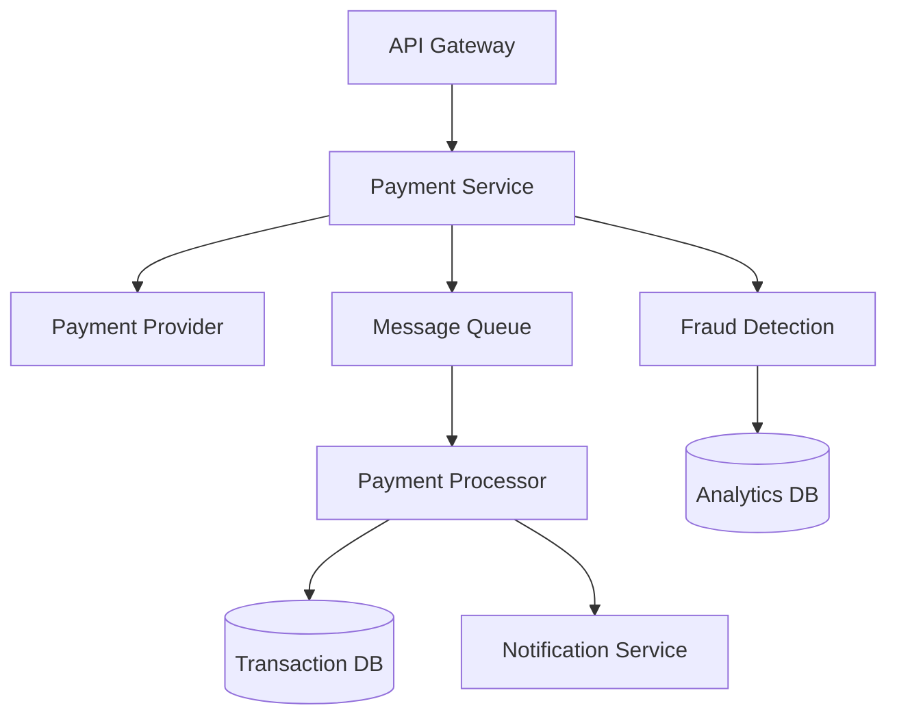
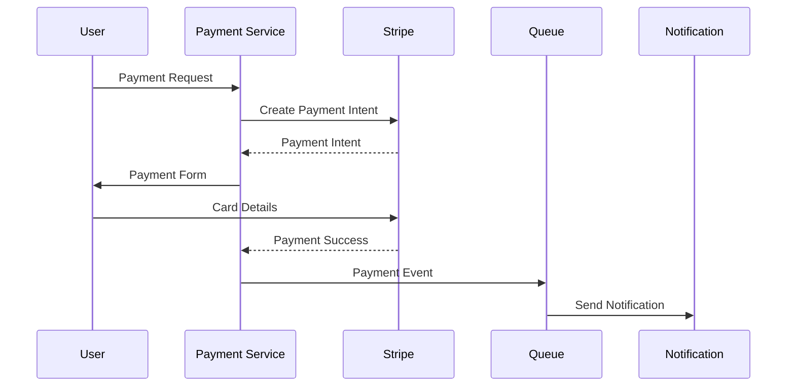

# Архитектура обработки платежей

## Метаданные

| Атрибут | Значение |
|---------|----------|
| Статус | ✅ Принято |
| Дата | 2024-01-02 |
| Автор | Команда разработки |
| Последнее обновление | 2024-01-05 |

## Контекст

Для обеспечения надежной и безопасной обработки платежей в системе краудфандинга необходимо выбрать оптимальное архитектурное решение.

### Ключевые требования

| Категория | Код | Требование | Целевое значение |
|-----------|-----|------------|------------------|
| Безопасность | SEC04 | PCI DSS | Level 1 |
| Безопасность | SEC05 | Шифрование | AES-256 + RSA |
| Безопасность | SEC06 | Аудит | 100% операций |
| Производительность | PER03 | Время обработки | ≤ 5 секунд |
| Масштабируемость | SCA03 | Пиковая нагрузка | 10,000 тр./час |
| Надежность | REL01 | Доставка | 100% |
| Надежность | REL02 | Двойные списания | 0 |
| Надежность | DUR02 | Восстановление | < 1 час |

### Архитектура платежей

## Рассмотренные варианты

### 1. Прямая интеграция 🏦

#### Преимущества
- 👍 Полный контроль процесса
- 👍 Минимальные комиссии
- 👍 Независимость от провайдеров
- 👍 Гибкая кастомизация

#### Недостатки
- 👎 Высокие требования к безопасности
- 👎 Сложность сертификации PCI DSS
- 👎 Длительная разработка
- 👎 Дорогая поддержка

### 2. Платежные агрегаторы (Stripe/PayPal) 💳

#### Преимущества
- 👍 Готовая инфраструктура
- 👍 PCI DSS compliance
- 👍 Быстрая интеграция
- 👍 Множество методов оплаты

#### Недостатки
- 👎 Высокие комиссии
- 👎 Зависимость от провайдера
- 👎 Ограниченная кастомизация
- 👎 Возможные простои

### 3. Гибридное решение 🔄

#### Преимущества
- 👍 Отказоустойчивость
- 👍 Гибкость выбора провайдера
- 👍 Оптимизация затрат
- 👍 Резервные каналы

#### Недостатки
- 👎 Сложность реализации
- 👎 Высокие затраты
- 👎 Сложность синхронизации
- 👎 Увеличенное время разработки

## Решение

> Выбрано поэтапное внедрение: Stripe → Гибридное решение

### Этап 1: Stripe (0-12 месяцев)

### Этап 2: Гибридное решение (12+ месяцев)

```mermaid
graph TB
    A[Load Balancer] --> B[Payment Gateway]
    B --> C[Provider Router]
    C --> D[Stripe]
    C --> E[PayPal]
    C --> F[Direct Processing]
    G[Analytics] --> H[Risk Engine]
    H --> C
    I[Queue] --> J[Payment Processor]
    J --> K[(Transaction DB)]
```

### Реализация

1. 🔒 Базовая интеграция
   - Stripe API
   - Webhook обработка
   - Тестовые платежи

2. 💳 Платежные методы
   - Карты (Visa/MC)
   - PayPal
   - Apple/Google Pay

3. 🛡️ Безопасность
   - PCI DSS compliance
   - Fraud detection
   - Tokenization

4. 📊 Мониторинг
   - Real-time метрики
   - Алерты
   - Аудит логи

### Технические детали

1. 🔧 Компоненты
   - Spring Boot
   - RabbitMQ
   - PostgreSQL
   - Redis

2. ⚙️ Конфигурация
   - Таймауты: 30с
   - Retry: 3x
   - Circuit breaker: 5 ошибок

## Последствия

### Положительные 👍
- Быстрый старт
- Надежная инфраструктура
- Гибкость развития
- Безопасность платежей
- Масштабируемость

### Отрицательные 👎
- Начальные ограничения
- Зависимость от Stripe
- Сложность миграции
- Двойные затраты при переходе

## План внедрения

### Фаза 1: Stripe (3 месяца)
1. 🔒 Базовая интеграция
   - Подключение API
   - Обработка webhooks
   - Тестовые платежи

2. 🛡️ Безопасность
   - Шифрование данных
   - Аудит операций
   - Fraud detection

3. 📊 Мониторинг
   - Метрики платежей
   - Алерты
   - Дашборды

### Фаза 2: Гибридное решение (6 месяцев)
1. 🏦 Прямые интеграции
   - Топ-3 платежных системы
   - Маршрутизация платежей
   - Балансировка нагрузки

2. 🔄 Отказоустойчивость
   - Автоматическое переключение
   - Репликация данных
   - Восстановление после сбоев

## Метрики успеха

| Метрика | Целевое значение |
|---------|------------------|
| Успешные платежи | > 99.9% |
| Время обработки | < 3 секунды |
| Отказы системы | < 0.01% |
| Возвраты | < 1% |

## Связанные ADR
- [2023-09.1 - Выбор архитектурной формы системы](./2023-09.1%20-%20Выбор%20архитектурной%20формы%20системы.md)
- [2024-01.1 - Выбор стратегии аутентификации и авторизации](./2024-01.1%20-%20Выбор%20стратегии%20аутентификации%20и%20авторизации.md)
- [2024-01.3 - Выбор событийно-ориентированной архитектуры](./2024-01.3%20-%20Выбор%20событийно-ориентированной%20архитектуры.md)
