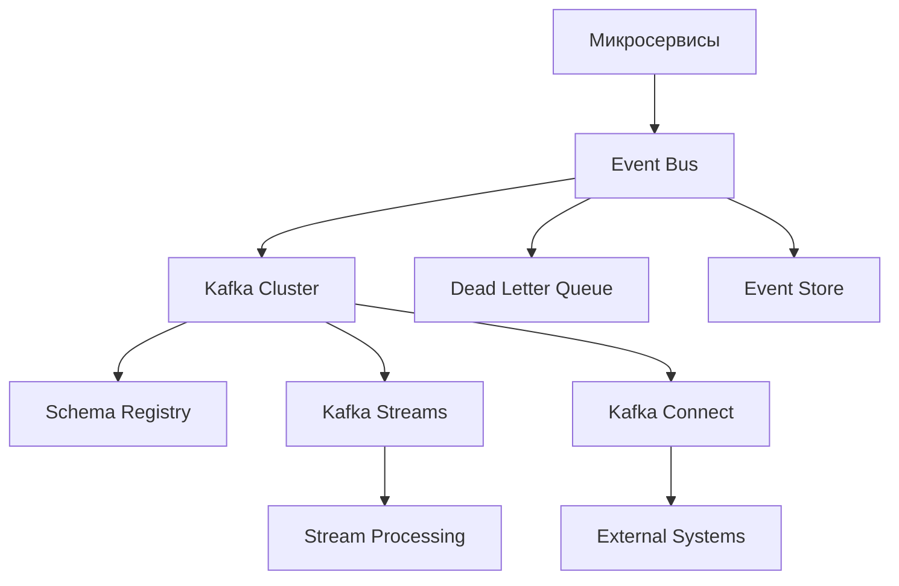
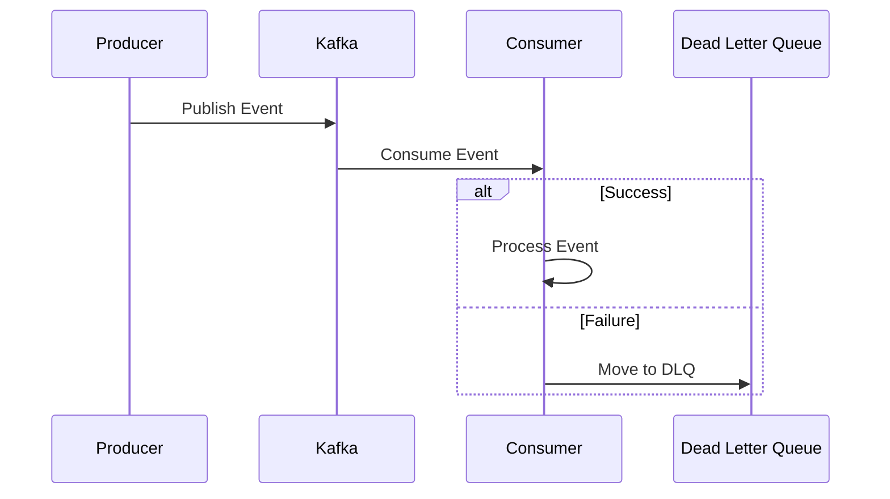

# Выбор событийно-ориентированной архитектуры

## Метаданные

| Атрибут | Значение |
|---------|----------|
| Статус | ✅ Принято |
| Дата | 2024-01-03 |
| Автор | Команда разработки |
| Последнее обновление | 2024-01-05 |

## Контекст

Для эффективной работы краудфандинговой платформы необходима надежная система обмена данными между микросервисами.

### Ключевые требования

| Категория | Код | Требование | Целевое значение |
|-----------|-----|------------|------------------|
| Масштабируемость | SCA02 | Пользователи | 1 000 000 |
| Масштабируемость | SCA03 | Пиковая нагрузка | 10 000 событий/час |
| Надежность | REL03 | Доставка событий | 100% гарантия |
| Надежность | DUR02 | Восстановление | < 1 час |
| Доступность | AVA01 | Uptime | 99.9% |
| Производительность | PER01 | Отклик | ≤ 2 секунд |
| Производительность | PER04 | Длительные операции | Асинхронно |

### Архитектурный контекст

## Рассмотренные варианты

### 1. Синхронная коммуникация (REST/gRPC)

#### Преимущества
- 👍 Простота реализации
- 👍 Немедленный ответ
- 👍 Предсказуемый поток данных
- 👍 Простая отладка

#### Недостатки
- 👎 Сильная связанность
- 👎 Каскадные сбои
- 👎 Блокирующие операции
- 👎 Сложность масштабирования

### 2. Событийно-ориентированная архитектура (EDA)

#### Преимущества
- 👍 Слабая связанность
- 👍 Отличная масштабируемость
- 👍 Асинхронность
- 👍 Отказоустойчивость

#### Недостатки
- 👎 Сложность отладки
- 👎 Eventual consistency
- 👎 Сложность разработки
- 👎 Управление схемами

### 3. Гибридный подход

#### Преимущества
- 👍 Гибкость выбора
- 👍 Оптимизация под задачи
- 👍 Баланс подходов
- 👍 Постепенное внедрение

#### Недостатки
- 👎 Сложность системы
- 👎 Двойная инфраструктура
- 👎 Сложность поддержки
- 👎 Повышенные затраты

## Решение

> Выбрана событийно-ориентированная архитектура на базе Apache Kafka

### Схема обработки событий

### Типы событий

| Категория | Примеры | Характеристики |
|-----------|---------|----------------|
| Доменные | ProjectCreated, FundingUpdated | Бизнес-события |
| Интеграционные | PaymentProcessed, EmailSent | Межсервисное взаимодействие |
| Системные | MetricsCollected, ErrorLogged | Мониторинг и отладка |

### Технический стек

| Компонент | Технология | Назначение |
|-----------|------------|------------|
| Message Broker | Apache Kafka | Центральная шина событий |
| Schema Management | Schema Registry | Управление форматами |
| Stream Processing | Kafka Streams | Обработка потоков |
| Monitoring | Prometheus + Grafana | Мониторинг системы |
| Tracing | OpenTelemetry | Распределенная трассировка |

## План внедрения

### Фаза 1: Базовая инфраструктура (2 месяца)
1. 🏗️ Настройка Kafka
   - Кластер с репликацией
   - Мониторинг
   - Безопасность

2. 📋 Определение схем
   - Avro schemas
   - Schema Registry
   - Версионирование

3. 🔄 Базовые паттерны
   - Producer/Consumer
   - Dead Letter Queue
   - Retry механизмы

### Фаза 2: Миграция сервисов (4 месяца)
1. 🚀 Критичные сервисы
   - Платежи
   - Уведомления
   - Аналитика

2. 📊 Мониторинг
   - Метрики
   - Алерты
   - Дашборды

3. 🛠️ Инструменты
   - Kafka UI
   - Отладка
   - Тестирование

## Последствия

### Положительные
- ✅ Отличная масштабируемость
- ✅ Слабая связанность
- ✅ Отказоустойчивость
- ✅ Асинхронность

### Отрицательные
- ❌ Сложность разработки
- ❌ Управление схемами
- ❌ Сложность отладки
- ❌ Повышенные требования к инфраструктуре

## Метрики успеха

| Метрика | Целевое значение |
|---------|------------------|
| Latency | < 100ms |
| Throughput | > 10k events/sec |
| Failed Events | < 0.01% |
| Recovery Time | < 5 min |

## Связанные ADR
- [2023-09.1 - Выбор архитектурной формы системы](./2023-09.1%20-%20Выбор%20архитектурной%20формы%20системы.md)
- [2024-01.1 - Выбор стратегии аутентификации и авторизации](./2024-01.1%20-%20Выбор%20стратегии%20аутентификации%20и%20авторизации.md)
- [2024-01.2 - Архитектура обработки платежей](./2024-01.2%20-%20Архитектура%20обработки%20платежей.md)
