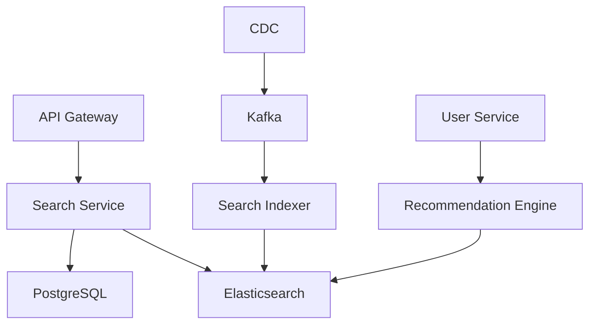
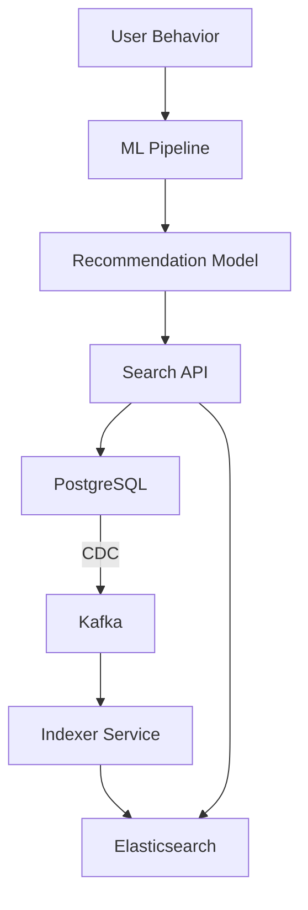

# Архитектура поиска и рекомендаций

## Метаданные

| Атрибут | Значение |
|---------|----------|
| Статус | ✅ Принято |
| Дата | 2024-01-04 |
| Автор | Команда разработки |
| Последнее обновление | 2024-01-05 |

## Контекст

### Ключевые метрики

| Категория | Код | Требование | Целевое значение |
|-----------|-----|------------|------------------|
| Производительность | PER01 | Время отклика поиска | ≤ 2 секунд |
| Производительность | PER05 | Актуальность результатов | 95% релевантности |
| Масштабируемость | SCA02 | Объем данных | 1 000 000 проектов |
| Масштабируемость | SCA04 | Обработка данных | Петабайты |
| Функциональность | FUN01 | Полнотекстовый поиск | ✓ |
| Функциональность | FUN02 | Фасетный поиск | ✓ |
| Функциональность | FUN03 | Персонализация | ✓ |
| Функциональность | FUN04 | Геопоиск | ✓ |

### Архитектура поиска

## Рассмотренные варианты

### 1. PostgreSQL Search 🔍

#### Преимущества
- 👍 Простота реализации
- 👍 Согласованность данных
- 👍 Единая система хранения

#### Недостатки
- 👎 Ограниченная производительность
- 👎 Сложность сложных поисковых функций
- 👎 Высокая нагрузка на БД

### 2. Elasticsearch 🚀

#### Преимущества
- 👍 Мощный полнотекстовый поиск
- 👍 Фасетный поиск из коробки
- 👍 Геопространственные возможности
- 👍 Высокая производительность

#### Недостатки
- 👎 Сложность поддержки
- 👎 Дополнительная инфраструктура
- 👎 Затраты на синхронизацию

### 3. Гибридное решение 🔄

#### Преимущества
- 👍 Сочетание лучших качеств
- 👍 Гибкость использования
- 👍 Оптимальная производительность

#### Недостатки
- 👎 Сложность синхронизации
- 👎 Повышенные требования
- 👎 Сложность поддержки

## Решение

> Выбрано гибридное решение с использованием PostgreSQL и Elasticsearch

### Компоненты решения

### Реализация

1. 🔄 Архитектура индексации
   - CDC для отслеживания изменений
   - Kafka для передачи событий
   - Bulk-операции индексации

2. 🔍 Поисковые функции
   - Морфологический поиск
   - Фасетная навигация
   - Геопоиск
   - ML-рекомендации

3. ⚡ Оптимизация
   - Кэширование запросов
   - Асинхронные обновления
   - Репликация данных

## Последствия

### Положительные 👍
- Мощные поисковые возможности
- Высокая производительность
- Гибкость реализации
- Масштабируемость

### Отрицательные 👎
- Сложность поддержки
- Синхронизация данных
- Повышенные требования
- Необходимость мониторинга
